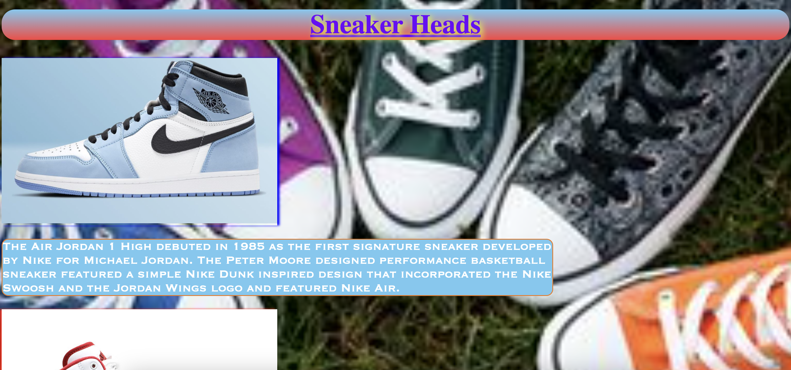

# Sneaker Heads Solution
**GOAL**: We are promoting the Air Jordan 1’s and Air Jordan 2’s. Your goal with this exercise is to take the pre-existing HTML and style it up using CSS! Take what we have provided in the repo and use your knowledge of CSS Selectors and Properties in order to transform it to the goal provided!

## HTML Specs
There is some placeholder text, but the company would like you to do the following:
- Connect the `style.css` file to the `index.html` using a `<link>` tag.
- Render the images inside `div id = "row1-section1"` and `div id = "row2-section-1"` with the following attributes:
    - [Image 1](https://ftw.usatoday.com/wp-content/uploads/sites/90/2021/03/Screen-Shot-2021-03-06-at-11.04.45-AM.png?w=1000&h=600&crop=1)
        - height: `400px` 
        - width: `600px` 
        - id: `"jordans-1"`
    - [Image 2](https://cdn.flightclub.com/TEMPLATE/011923/1.jpg)
        - height: `400px` 
        - width: `600px` 
        - id: `"jordans-2"`
- Update the `
` text to include a link to buy Jordan 1's and Jordan 2's
    - Jordan 1 Link: https://www.jordan.com/collection/air-jordan-1
    - Jordan 2 Link: https://www.jordan.com/collection/air-jordan-2

## Design Specs
The company you are producing the website has given you the following specs (also found on the `style.css` file) to help guide the website that you design. To achieve the desired design, you should utilize the following properties inside your selectors:
- `background-color`
- `background-image`
- `background-size`
- `border`
- `border-radius`
- `box-shadow`
- `color`
- `font-size`
- `font-family`
- `linear-gradient`
- `height`
- `text-align`
- `text-decoration`
- `text-shadow`
- `width`

Utilize the following design specifications below with the properties above to achieve the desired output:

### Colors
- yellow
- red
- `#f3b76a`
- `#f17500`
- `#0d6e00`
- `#6d00fb`
- `#dbff39`
- `#74c9f1`
- `#fb4040`

### Sizes:
- `100%`
- `70%`
- `25%`
- `auto`
- `1.5em`
- `3rem`
- `0.5em`

### Font:
- Copperplate   
    - You can also use any font that you'd like though! Some other common fonts can be [found here](https://www.w3schools.com/css/css_font.asp) 🔍.

### Background Image:
- https://i.pinimg.com/236x/d6/3f/56/d63f563519df0ece564b82c72e9e306c.jpg

## Done Early? Try these stretch problems! 🚀
- Explore using `margin` and `padding` to align the images and text in the center of the page

- Get all the images and text to be in the same row

